# GIF Guide: Creating a PWA with Vue and Kendo UI

Progressive Web Apps (PWAs) help us create more accessible and engaging web applications. We have a few great posts to help you learn more about PWAs: [this series from Raymond Camden](https://www.telerik.com/blogs/a-gentle-and-practical-introduction-to-progressive-web-apps) or [or this great Vue.js specific post from Brandon Satrom](https://www.telerik.com/blogs/building-pwas-with-vuejs). Today, we can jump into creating a PWA using the handy PWA template from the Vue CLI. We'll first create an application using the Kendo UI components which will help us quickly build out a responsive and accessible web application.

### Step-by-step
- Create an application with the [Vue CLI](https://github.com/vuejs/vue-cli)
- Adding [Kendo UI Components](https://www.telerik.com/kendo-vue-ui/components/)
- Additional Styling
- Updating the [App Manifest](https://developer.mozilla.org/en-US/docs/Web/Manifest)
- Checking out [Offline Caching](https://developer.mozilla.org/en-US/docs/Web/API/Service_Worker_API/Using_Service_Workers)

### The Code 👩‍💻
How great is version control, amirite?! For this project you check out all of the code [at this repo](https://github.com/tzmanics/gif-guide_pwa-kendoui-vue). There will also be a handy octopus emoji (🐙) at the end of each section that will link you to a git commit showing all the code changes for that section. Ok, it's coding time!

## Time to Create

The Vue CLI has a great [PWA template](https://github.com/vuejs-templates/pwa) to get us started with a PWA Vue app skeleton. The first step we take is to globally install the Vue CLI using `i` for install and the `-g` flag for global.

`npm i vue-cli -g`


With the CLI tool we can use it to create a project using the `vue init` command. Since we are creating a PWA we'll pass in `pwa` for the template and our project name.

`vue init <template> <project name>`


Once the project is created you'll see that it prompts us to change into the project directory and install the dependencies by running `npm install` or just `npm i` for short. Guess what we're going to do next. Follow directions of course! What kind of rebels do you think we are?

```bash
cd gif-guide_pwa-kendoui-vue
npm i
```


Now that we have everything we need to run the skeleton project we can run it and take a look using `npm run dev`.


A project is born 👶! Knowing that we have a nice, running project will give us a good jump off point to break things, um, I mean, customize things. Let's quickly add some fun functionality using Kendo UI components.

[🐙](https://github.com/tzmanics/gif-guide_pwa-kendoui-vue/commit/82ded4f410191800853003fc9c7e5d078b09afed) Hello? This is code 😋 Click the Octopus for the first commit.

## UI Components For You & Me! 📅

The app we create today will give us the first steps in letting users log what emotions they are feeling each day. For now, we'll make a place for the user to set a date, choose from a small list of emojis and see a graph of the logged emotions. Here is the list of components we'll use today:

- [Buttons](https://www.telerik.com/kendo-vue-ui/components/buttons/button/) for submitting
- [Chart](https://www.telerik.com/kendo-vue-ui/components/charts/chart/) for visualizing the emotions
- [DatePicker](https://www.telerik.com/kendo-vue-ui/components/dateinputs/datepicker/), you guessed it, for picking the date
- [DropdownList](https://www.telerik.com/kendo-vue-ui/components/dropdowns/dropdownlist/) for quick emotion selection

### Installing the Components

As with most of the Kendo UI components, the first step we take is to install the component libraries. For the Vue library, we'll also want to install the Kendo UI library. I also want some styling, UX and accessibility. Thankfully, all of this (and more 😯) comes with installing one of the [Kendo UI themes](https://www.telerik.com/kendo-vue-ui/components/styling/). For this project we'll use the [Material theme](https://www.telerik.com/kendo-vue-ui/components/styling/theme-material/) that is currently in beta.

This can all be installed in one lovely `npm` install command:

> `npm i @progress/kendo-buttons-vue-wrapper @progress/kendo-charts-vue-wrapper @progress/kendo-dateinputs-vue-wrapper @progress/kendo-dropdowns-vue-wrapper @progress/kendo-theme-material @progress/kendo-ui`

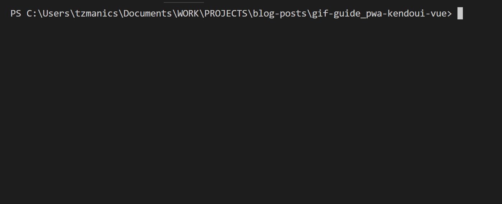

[🐙](https://github.com/tzmanics/gif-guide_pwa-kendoui-vue/commit/4ee682ed2e8b818a8b4771952614e6fa4c49fe1f) Moar code!

### My Main!

We've got libraries! In the `main.js` file we can import just the components that we'll be using for this project from each of the libraries installed.

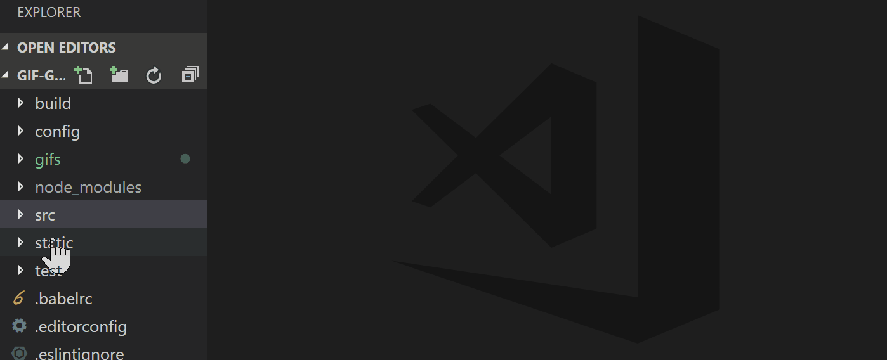

Now we use all that we've imported including the component installers which we'll pass to `Vue.use()`.

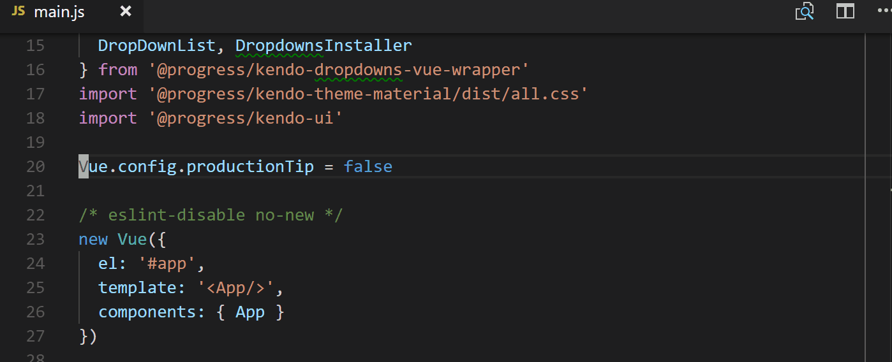

This is what the complete file looks like now:

```js
// src/main.js

import Vue from 'vue'
import App from './App'
import {
  Button, ButtonsInstaller
} from '@progress/kendo-buttons-vue-wrapper'
import {
  Chart, ChartInstaller
} from '@progress/kendo-charts-vue-wrapper'
import {
  DatePicker, DateinputsInstaller
} from '@progress/kendo-dateinputs-vue-wrapper'
import {
  DropDownList, DropdownsInstaller
} from '@progress/kendo-dropdowns-vue-wrapper'
import '@progress/kendo-theme-material/dist/all.css'
import '@progress/kendo-ui'

Vue.config.productionTip = false
Vue.use(ButtonsInstaller)
Vue.use(ChartInstaller)
Vue.use(DateinputsInstaller)
Vue.use(DropdownsInstaller)

/* eslint-disable no-new */
new Vue({
  el: '#app',
  template: '<App/>',
  components: {
    App,
    Button,
    Chart,
    DatePicker,
    DropDownList
  }
})
```

[🐙](https://github.com/tzmanics/gif-guide_pwa-kendoui-vue/commit/2699cebb89263963c0cfc2a56321622c1217e47a) The `main.js` changes commit.

### The `.vue` Files

To actually put these components in the game, we have to edit the `App.vue` and `Hello.vue` files. With the `App.vue` file we'll mostly be deleting things, adding a few headers and the new component we'll make.


Here is what the `App.vue` looks like now:

```
// src/App.vue

<template>
  <div id="app">
    <h1> EIV </h1>
    <h4> emotions in view </h4>
    <emotion-input></emotion-input>
  </div>
</template>

<script>
import EmotionInput from './components/EmotionInput'

export default {
  name: 'app',
  components: {
    EmotionInput
  }
}
</script>

<style>
</style>
```

[🐙](https://github.com/tzmanics/gif-guide_pwa-kendoui-vue/commit/010b5a122e0c7402284d30893fc7b973f297de22) The commit of the `App.vue` changes.

### Template Time ⏰

We'll actually just be editing and changing the name of the `Hello.vue` to make it a little easier. Inside, we'll delete the existing code.

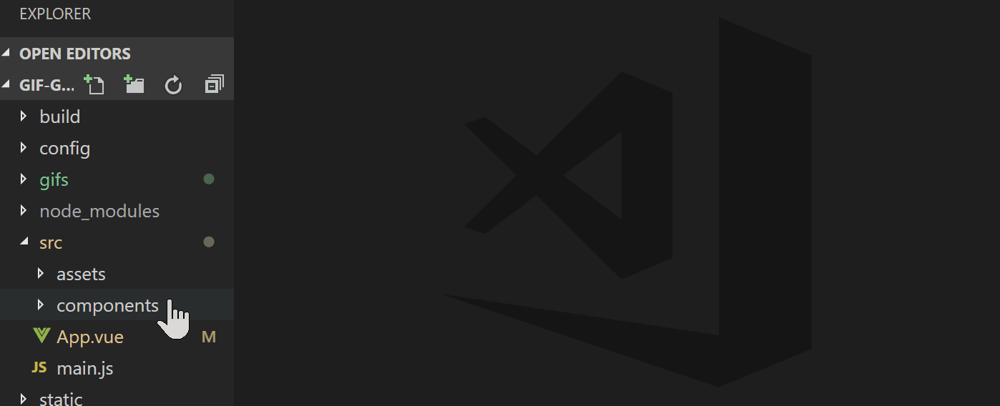

Then we can add each component that will be rendered on the page. Inside of a `div` we'll call `emotion-logging` we add the place to pick a date and an emotion. First up, will be the `DatePicker` component. Here is what we're setting for the `DatePicker`:
- `v-model`: Vue's two-way binding to keep the date updated whenever it's changed
- `min`: for the most far away date the user can choose
- `max`: the most recent date the user can choose
- `value`: what's placed in the text box, we'll use the `v-model` for this
- `format`: how the date will be displayed

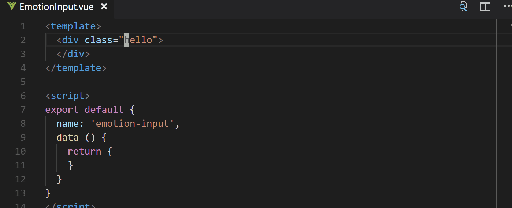

The next component is the `dropdownlist` we'll populate it with a few emojis for users to pick from. The configurations we'll change here are:

- `v-model`: to keep track of which value the user picks
- `data-source`: the array of choices we'll be passing to the list
- `index`: the index of the default, so `0` would be the first thing in our array

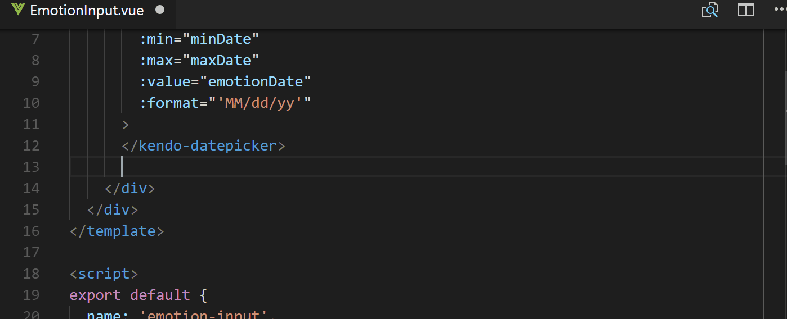

Finally, we'll add the button to submit the new emotion and make a new `div` to add a chart component to visualize the added emotions. For the Kendo UI button we just need to add a click event listener with `@click`. When that event is triggered we want it to call the `addEmotion` method that will update the tally of the chosen emotion. The chart component will have more configurations:

- `series-default-type`: this is the type of graph, e.g. `pie`, `donut`, etc.
- `chart-area-background`: the default is a white background, here we don't want a background so we make it blank
- `series`: the data to display in graph form
- `tooltip`: setting if the tooltip is visible and what information it shows

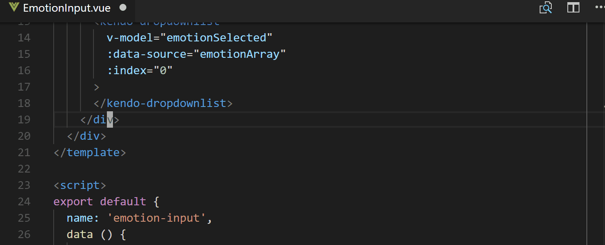

Voila, the top half (template section) of the `EmotionInput` component file:

```
// src/components/EmotionInput.vue

<template>
  <div class="emotion-box">
    <div class="emotion-logging">
      <h2> What are you feeling? </h2>
      <kendo-datepicker
        v-model="emotionDate"
        :min="minDate"
        :max="maxDate"
        :value="emotionDate"
        :format="'MM/dd/yy'"
      >
      </kendo-datepicker>
      <kendo-dropdownlist
        v-model="emotionSelected"
        :data-source="emotionArray"
        :index="0"
      >
      </kendo-dropdownlist>
      <kendo-button @click='addEmotion'> Add Emotion </kendo-button>
    </div>
    <div class="emotion-graph">
      <kendo-chart
        :series-defaults-type="'pie'"
        :chart-area-background="''"
        :series="series"
        :tooltip="tooltip"
      >
      </kendo-chart>
    </div>
  </div>
</template>
...

```

[🐙](https://github.com/tzmanics/gif-guide_pwa-kendoui-vue/commit/a64e851f2e7488c863d0a355f7e60fee9ce120fd) Lookey here! Components get added to the template 😃

### Beyond the Template

We now need to give values to all these different configurations we made. What better place to start than with the data we pass to our component. Here we return the variables that we've used inside out component like `emotionDate`, `minDate`, `maxDate`, `emotionArray`, `emotionSelected`, and `tooltip`. We'll also add a few variables that will be used inside of the method for incrementing the frequency of each emotion chosen: `happyFeels`, `sadFeels`, `funnyFeels`, and `angryFeels`. These are also what is used in the `series` data for the chart.

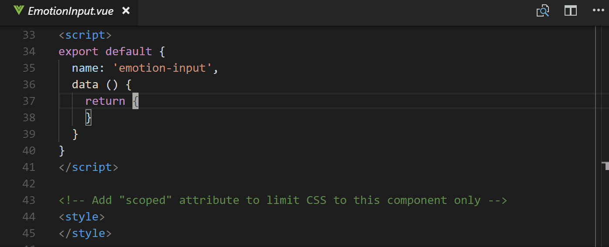

The method that we add here is the one assigned to the click event on our button. Basically, it gets passed the `this.emotionSelected` which is, thanks to `v-model`, updated when a user picks an emotion from the dropdown. Based on which emotion is selected, it increments the count for that emotion.

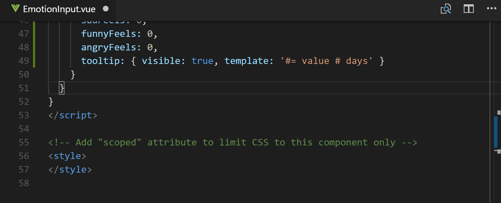

Finally, in order to always have the data for the chart component up-to-date, we use [computed properties](https://v1.vuejs.org/guide/computed.html). Inside `computed` we create `series` which we had assigned to the `series` configuration of our chart. This way, when the `addEmotion` updates one of the emotions the `data` array is also updated. This means the graph will update with each added emotion.

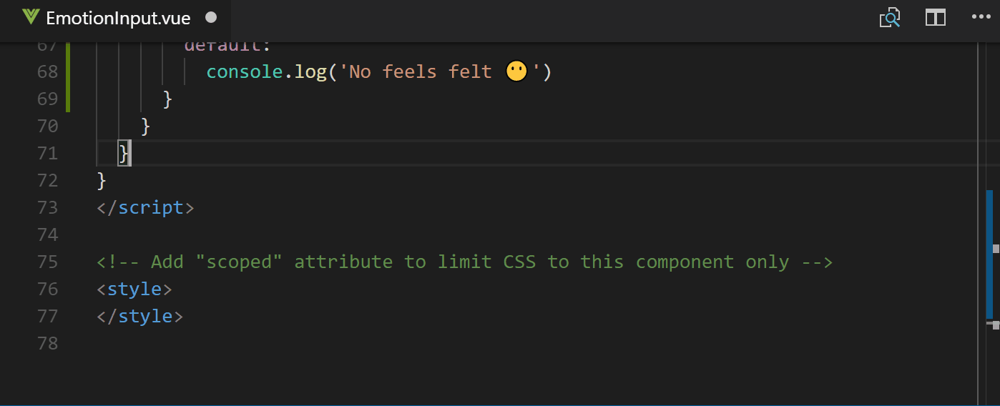

Now the bottom half, or script section of the `EmotionInput.vue` file will look like this:

```js
// src/components/EmotionInput.vue

...
</template>

<script>
export default {
  name: 'emotion-input',
  data () {
    return {
      emotionDate: new Date(),
      minDate: new Date(2017, 1, 1),
      maxDate: new Date(),
      emotionArray: [
        '😃', '😢', '🤣', '😡'
      ],
      emotionSelected: '😃',
      happyFeels: 0,
      sadFeels: 0,
      funnyFeels: 0,
      angryFeels: 0,
      tooltip: { visible: true, template: '#= value # days' }
    }
  },
  methods: {
    addEmotion () {
      switch (this.emotionSelected) {
        case '😃':
          this.happyFeels++
          break
        case '😢':
          this.sadFeels++
          break
        case '🤣':
          this.funnyFeels++
          break
        case '😡':
          this.angryFeels++
          break
        default:
          console.log('No feels felt 😶')
      }
    }
  },
  computed: {
    series: function () {
      return [{
        data: [{
          category: '😃',
          value: this.happyFeels,
          color: '#BCFF3A'
        }, {
          category: '😢',
          value: this.sadFeels,
          color: '#5A9CE8'
        }, {
          category: '🤣',
          value: this.funnyFeels,
          color: '#E8DC36'
        }, {
          category: '😡',
          value: this.angryFeels,
          color: '#FF3938'
        }, {
        }]
      }]
    }
  }
}
</script>
...

```

If you still have your app running in the background or run `npm start` you can see the working app.

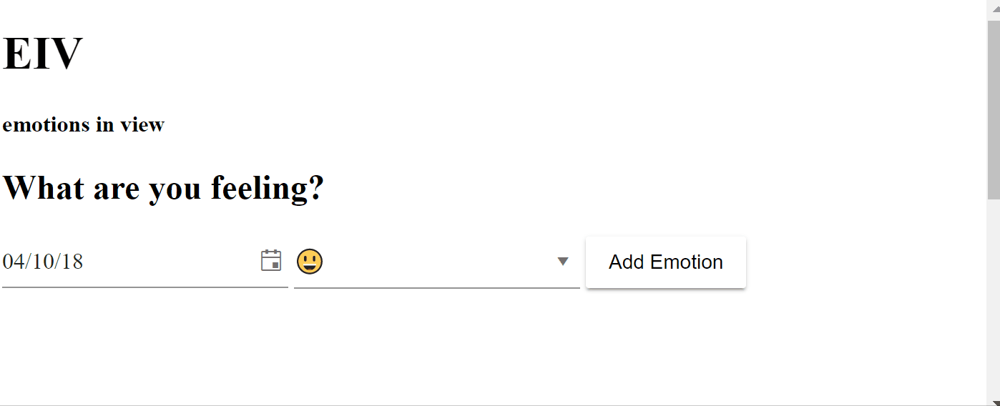

[🐙](https://github.com/tzmanics/gif-guide_pwa-kendoui-vue/commit/b52c044b0174cbc62d1841dbc35020aa14957def) The commit for the fun script section we added!

## Looking Good: Additional Styling

Real quickly to make our application even more lovely we're going to add some styling. To style the overall application we'll first add some styling to the `App.vue` file.

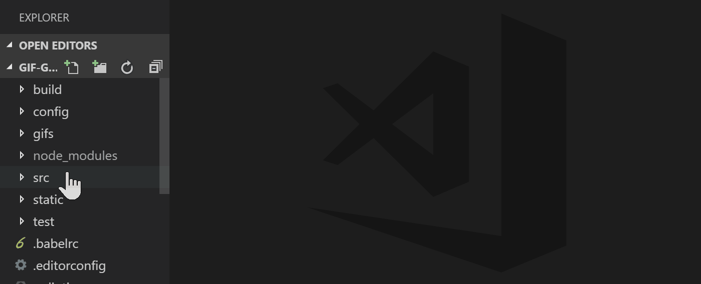

Then for specific component styling we edit the `EmotionInput.vue` file 💁‍.

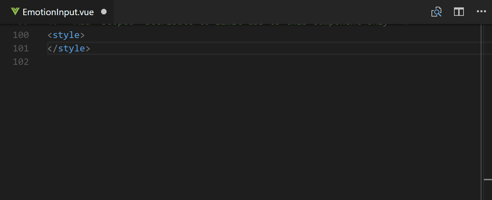

Take a look at the style sections of each of these files now:

```
// src/App.vue

...
<style>
@import url('https://fonts.googleapis.com/css?family=Josefin+Sans:300,700i');
body {
  background-image: url('https://bit.ly/2qcNnVs');
  font-family: 'Josefin Sans', sans-serif;
  margin: 0;
  padding: 1em;
}

h1 {
  font-weight: 700; 
  font-size: 2.8em;
  letter-spacing: 12px;
  margin: 0;
}

h2, h4 {
  font-weight: 300;
}

h4 {
  letter-spacing: -1px;
  margin-top: 0;
}
</style>
```

```
// src/components/EmotionInput.vue

...
<style>
  .emotion-box {
    background-color: rgba(255, 255, 255, 0.5);
    margin: 0 auto;
    min-width: 600px;
    padding: 15px;
    width: 47%;
  }

  .k-chart {
    width: 90%;
  }
</style>
```

Running our app with `npm start` will let us take a look at what we have now!

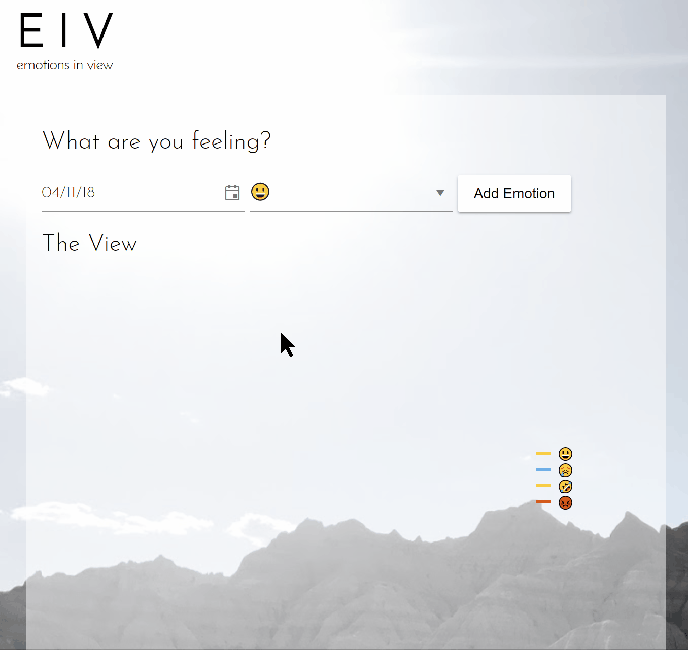

[🐙](https://github.com/tzmanics/gif-guide_pwa-kendoui-vue/commit/cca3e8a05b0dbe6dc98399c933a0560b7c733cc9) Stylin' code changes.

## Getting Fancy with the App Manifest 💅

The [App Manifest](https://developer.mozilla.org/en-US/docs/Web/Manifest) is a great place to start jumping into PWAs because it is a simple `json` file that lets you add some awesome features. You can find this file in the `static` directory. If you look inside `dist/index.html` after you've built your project you can search for `manifest` to see how it gets loaded in. On other projects you can add it by just linking to it like this, `<link rel="manifest" href="/manifest.webmanifest">` in the `head` of you document.

These are the values we'll be assigning in our manifest:
- `name`: This is described as the `human-readable name` on MDN, it can be used when your app is listed but the `short_name` will be used instead if this name is too long to display.
- `short_name`: Well, speak of the devil 😈 This is the name that will usually get displayed in places like a user's homescreen where there is not sufficient space for the `name`. PLUS, IT SUPPORTS EMOJI!! ✨👏🎊🙌
- `icons`: The `icons` are an array consisting of image objects with `src`, `sizes`, and `type` values. This determines what icons represent your app on different platforms like when a user adds your app to their homescreen.
- `start_url`: When a user launches your application this is the url it will load. This url has to be relative to the site origin.
- `display`: This nifty setting let's you choose to have a fullscreen app by using `standalone` || `fullscreen` and removing the browser chrome, keep it and setting it to `browser`, OR keep it minimal with `minimal-ui`.
- `background_color`: A little self-explanatory, this sets the background color of your application. The main advantage of using this is to give your user a smooth transition from opening the app and when the app is loaded by showing a color change so they know something is happening.
- `theme_color`: The theme color of the application can affect how the app is displayed dependent on the OS. For instance, with Android when you look at the app in the app tray it will have this color as the app's border color. 

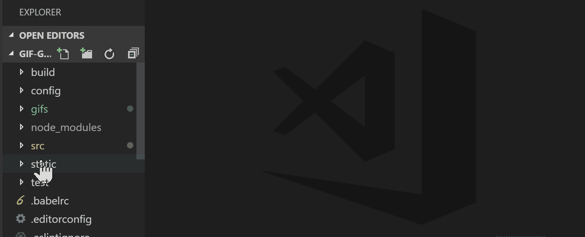

As you can see in this gif, there are a lot of icon options that can be added to the `manifest.json` file. I usually just take one image and resize and save it to the correct file name. Here I've just chosen a thinking face emoji `png` and resized it for each existing icon image.


Now that we have all of the icons and the App Manifest set up we can head to our app and see the changes. If you open up Dev Tools, here we're using Chrome, and click on the Application tab you'll see a Manifest tab on the left. In here you can see where the Manifest file lives along with all of the values we've assigned. It also gives you a glimpse of what your icons look like as well.


In the end, the App Manifest file will look like this. Remember, you can go back and add more!

*static/manifest.json*
```json
{
  "name": "emotions-in-vue",
  "short_name": "😃😢🤣😡",
  "icons": [
    {
      "src": "/static/img/icons/android-chrome-192x192.png",
      "sizes": "192x192",
      "type": "image/png"
    },
    {
      "src": "/static/img/icons/android-chrome-512x512.png",
      "sizes": "512x512",
      "type": "image/png"
    }
  ],
  "start_url": "/index.html",
  "display": "standalone",
  "background_color": "#E8DC36",
  "theme_color": "#5A9CE8"
}

```

[🐙](https://github.com/tzmanics/gif-guide_pwa-kendoui-vue/commit/5876cc5bad5821d4f814fdac3d4ced613420e670) The App Manifest code changes.

## 👁 Service Worker for Offline Caching

We now have the ability to make our application fullscreen, give it fancy emojis and icons for user's home screens, what next? With [Service Workers](https://developers.google.com/web/fundamentals/primers/service-workers/) there are a lot of great advancements that can be added to your application. The Service Worker file is a script that runs, separate from your app, in the background between your app and your network. To start us out though the vue CLI actually sets us up with a Service Worker that caches some of our resources for offline functionality. Take a look!

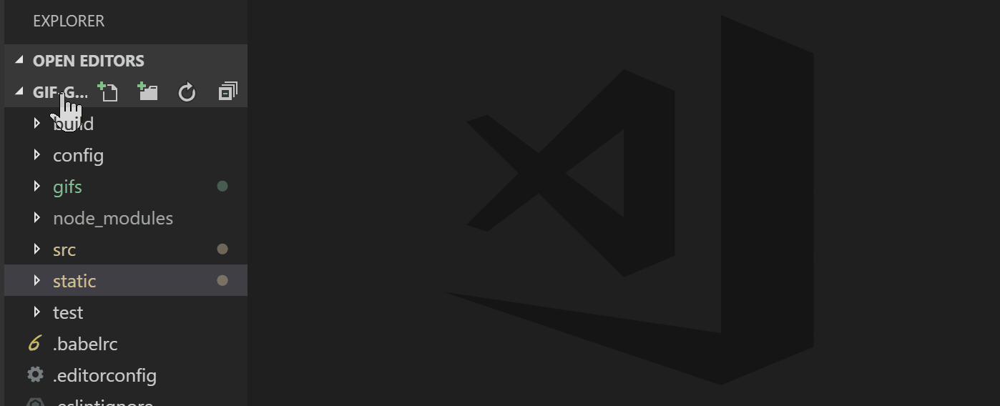

Service Workers can be a bit daunting but it's good to remember they are _just_ JavaScript files. If you look through it's mostly using promises and if statements to listen to events. It's also progressive. If you noticed, there is a line in the file that checks to see if `serviceWorker` is supported.

`if ('serviceWorker' in navigator ...`

So, if you add a Service Worker it won't break your app 👍 There is a lot more to Service Workers so I highly recommend reading more like [this great post on Service Workers](https://www.telerik.com/blogs/a-gentle-and-practical-introduction-to-progressive-web-apps-part-3) from [Raymond Camden](https://twitter.com/raymondcamden) or checking out [this podcast](https://www.crowdcast.io/e/dshawaf4) I just did with [Jake Archibald](https://twitter.com/jaffathecake), [Matt Gaunt](https://twitter.com/gauntface), [Patrick Kettner](https://twitter.com/patrickkettner) and [Dan Shaw](https://twitter.com/dshaw)

Let's see this Service Worker we have in action! To start we want to build our app bu running `npm run build`.

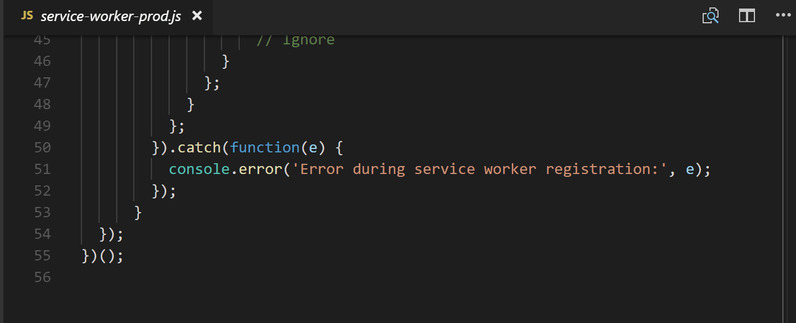

### Deploy, deploy!

The app is built! Which means that we have everything we need to deploy our application living in the `dist` directory. There are many great ways to deploy an application, today we'll use the [Firebase CLI](https://github.com/firebase/firebase-tools). To use it you first install it globally with npm.

`npm install -g firebase-tools`

Then from your project's directory run `firebase init`. It will walk you through a few steps. First, we just check `Hosting`, pick a project (I had already made one in my Firebase Console), then assign the `dist` directory since the files we want hosted are located inside. There are more options for making your app an SPA (single page app) and re-writing the `index.html` but I just said no to all of that for now.

After the setup is complete all you need to do is run `firebase deploy` any time you want to re-deploy your application.

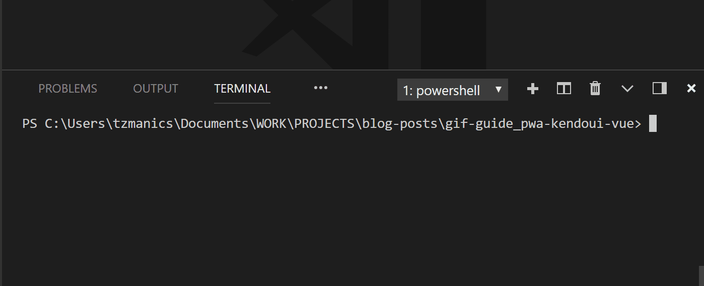

Deployment complete! We can take a look at our hosted application. To see what is going on with the Service Worker, head back to the Application tab in the Dev Tools. Where the Manifest tab was on the left side, there is also a Service Workers tab. Clicking that you can see the information of our Service Worker and that it is registered. By default, the 'Update on reload` is checked so that we make sure we are keeping things up-to-date. This is a great place to debug your Service Workers.

To take a look at the caching in action, we'll click the `offline` checkbox to disconnect from the network. It is worth remembering to try completely disconnecting from your own WIFI or network to see how your app serves truly offline. If you notice when we reload, the background image is no longer there because we were grabbing that from another site (my google photos) that can't be reached without a network. Beyond that, everything is working as it's supposed to. Thanks, Service Worker 😃👍

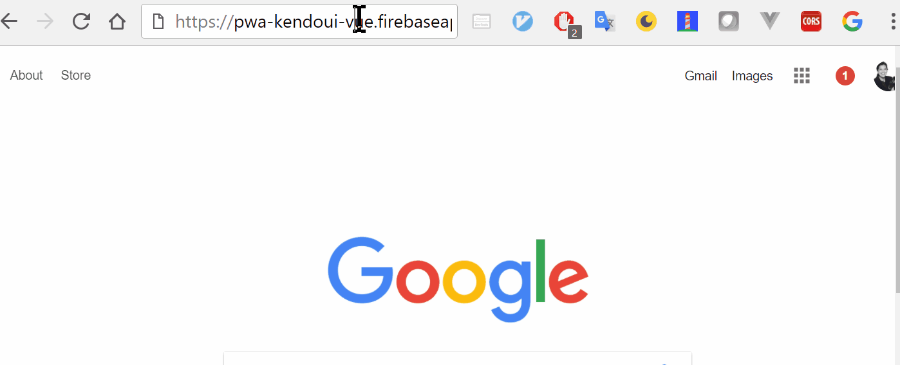

There are a lot of caveats with caching, so it's worth doing some research before having your user cache your whole site 😋. Here a few posts I recommend:

- [Offline Storage for Progressive Web Apps - Addy Osmani](https://medium.com/dev-channel/offline-storage-for-progressive-web-apps-70d52695513c)
- [The Offline Cookbook by Jake Archibald](https://developers.google.com/web/fundamentals/instant-and-offline/offline-cookbook/)
- [Caching Files with Service Worker](https://developers.google.com/web/ilt/pwa/caching-files-with-service-worker)

[🐙](https://github.com/tzmanics/gif-guide_pwa-kendoui-vue/commit/27046ad7f9460f076e9f495d2a2d53ff763711ea) Commit of the new firebase setup files. 

## Donezo! ✅

We haz a Progressive Web App in Vue 👀!! There are a lot of steps we can continue to take to make our applications more PWA-y. For instance, we can use the [Push API](https://developers.google.com/web/fundamentals/codelabs/push-notifications/) to create a service worker that send push notifications to let a user know to log their emotion for the day. Nifty, right? Here are a bunch of fun resources to help you build a more robust application with some more components and more PWA-y with more PWA info:

- [Kendo UI Vue Components](https://www.telerik.com/kendo-vue-ui)
- [Lighthouse PWA Tool](https://developers.google.com/web/tools/lighthouse/)
- [MDN's PWA Docs](https://developer.mozilla.org/en-US/Apps/Progressive)
- [Project Repo](https://github.com/tzmanics/gif-guide_pwa-kendoui-vue)
