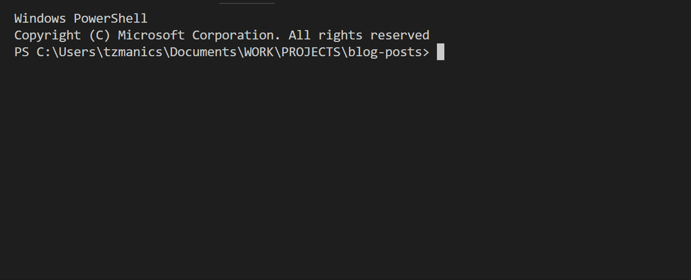
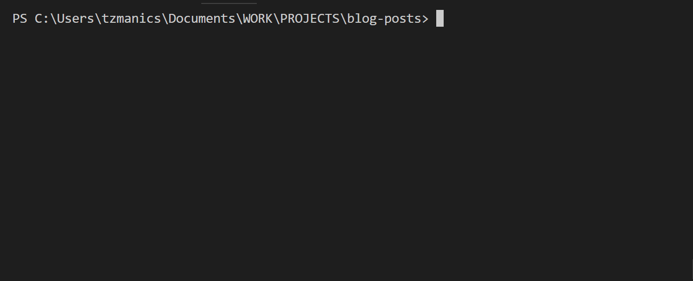
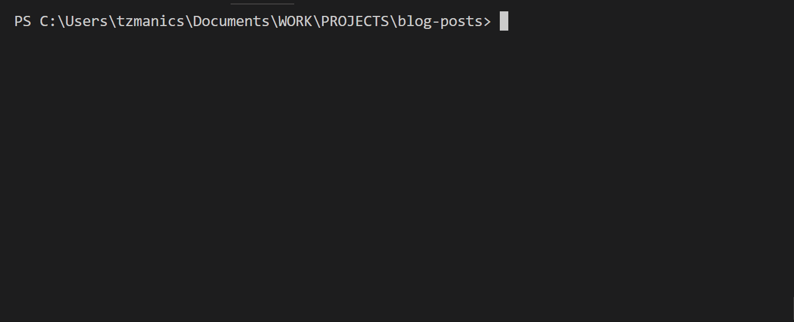
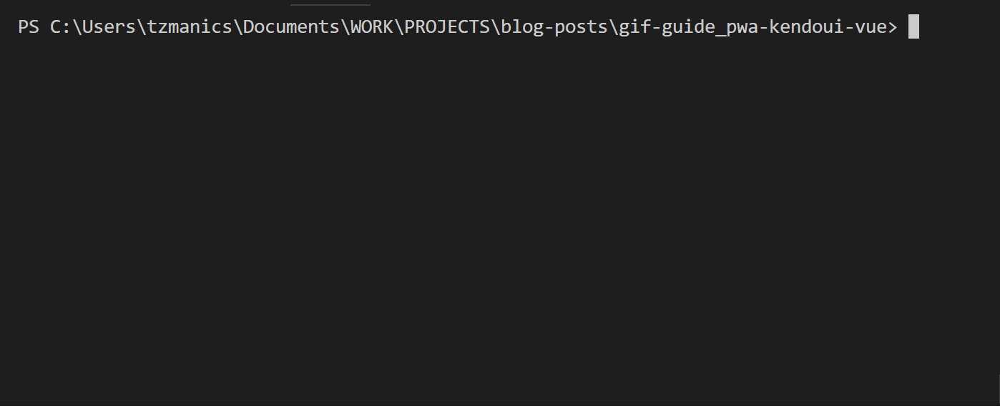

# GIF Guide: Creating a PWA with Vue and Kendo UI

Progressive Web Apps (PWAs) help us create more accessible and engaging web applications. We have a few great posts to help you learn more about PWAs: [post 1]() [post 2](). Today, we can jump into creating a PWA using the handy PWA template from the Vue CLI. We'll first create an application using the Kendo UI components, which will help us quickly build out a responsive and accessible web application.

### Step-by-step
- Create an application with the [Vue CLI](https://github.com/vuejs/vue-cli)
- Adding Kendo UI Components
- Additional Styling
- Updating the App Manifest
- Checking out Offline Caching

### The Code 💁‍♀️
How great is version control, amirite?! For this project you check out all of the code [at this repo](https://github.com/tzmanics/gif-guide_pwa-kendoui-vue). There will also be a handy octopus emoji (🐙) at the end of each section that will link you to a git commit showing all the code changes for that section. Ok, it's coding time!

## Time to Create

The Vue CLI has a great [PWA template](https://github.com/vuejs-templates/pwa) to get us started with a PWA Vue app skeleton. The first step we take is to globally install the Vue CLI using `i` for install and the `-g` flag for global.

`npm i vue-cli -g`



With the CLI tool we can use it to create a project using the `vue init` command. Since we are creating a PWA we'll pass in `pwa` for the template and our project name.

`vue init <template> <project name>`



Once the project is created you'll see that it prompts us to change into the project directory and install the dependencies by running `npm install` or just `npm i` for short. Guess what we're going to do next. Follow directions of course! What kind of heathens do you think we are?

```bash
cd gif-guide_pwa-kendoui-vue
npm i
```



Now that we have everything we need to run the skeleton project we can run it and take a look using `npm run dev`.



A project is born 👶! Knowing that we have a nice, running project will give us a good jump off point to break things, um, I mean, customize things. Let's quickly add some fun functionality using Kendo UI components.

[🐙](https://github.com/tzmanics/gif-guide_pwa-kendoui-vue/commit/82ded4f410191800853003fc9c7e5d078b09afed) Hello? This is code 😋 Click the Octopus for the first commit.

## UI Component Time! 📅

## Looking Good: Additional Styling

## Getting Fancy with the App Manifest 💅

## 👁 Service Worker for Offline Caching

## Donezo! �
We haz a Progressive Web App in Vue 👀!! There are a lot of steps we can continue to take to make our applications more PWA-y. For instance, we can use the [Push API](https://developers.google.com/web/fundamentals/codelabs/push-notifications/) to create a service worker that send push notifications to let a user know to log their emotion for the day. Nifty, right? Here are a bunch of fun resources to help you build a more robust application with some more components and more PWA-y with more PWA info:

- [Kendo UI Vue Components](https://www.telerik.com/kendo-vue-ui)
- [Lighthouse PWA Tool](https://developers.google.com/web/tools/lighthouse/)
- [MDN's PWA Docs](https://developer.mozilla.org/en-US/Apps/Progressive)
- [Project Repo](https://github.com/tzmanics/gif-guide_pwa-kendoui-vue)